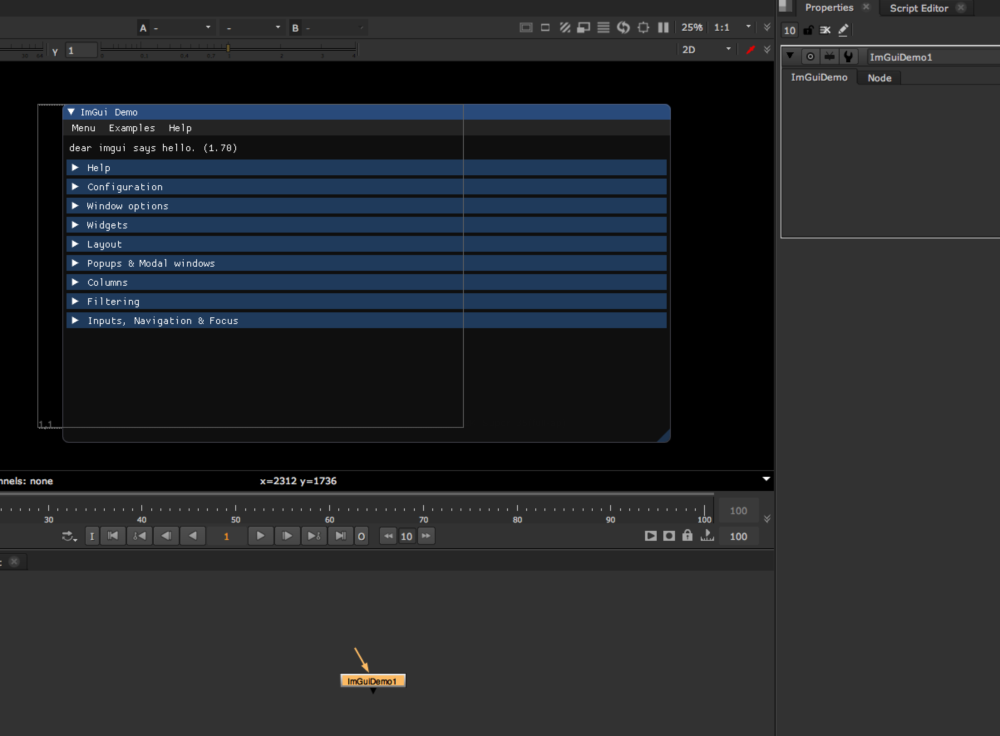

# imgui-nuke
A simple header only implementation of imgui for Foundry's Nuke software.

# installation

## imgui

Download the desired version of imgui from https://github.com/ocornut/imgui and extract the headers into the imgui-nuke/third-party directory. Then update the IMGUI_VERSION CMake variable to the installed version number, eg. 1.70.

## nuke
### mac osx
Set the NUKE_VERSION CMake variable to the version of Nuke to compile against, eg. 11.2v5, assuming standard installation.
### linux
TODO: CMake needs to be setup to work with Nuke on Linux.

# usage
demo.cpp is the standard example of how to compile against imgui_nuke.h and add imgui to your plugins. The demo shows all of the different types of widgets, layouts, windows and how they can easily be used to render a gui inside of Nuke's viewer.

# known issues
imgui-nuke only works with the mouse events as the ViewerContext doesn't correctly report keyboard events yet.